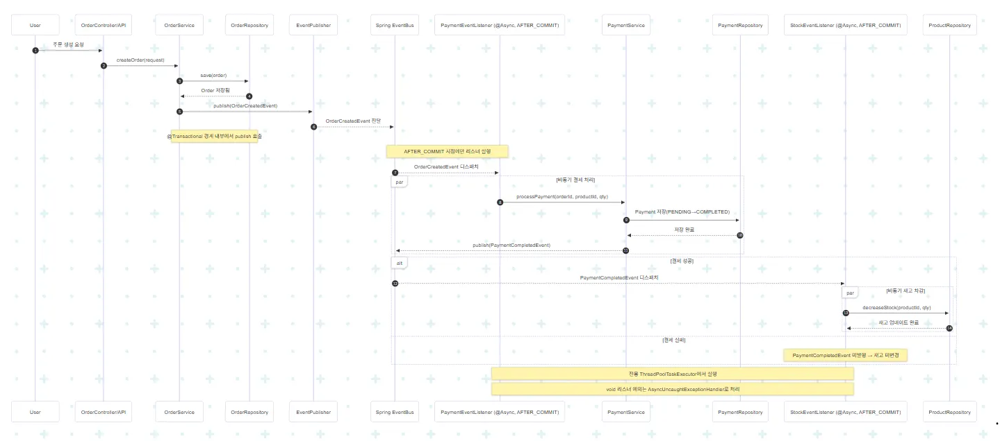

# 이벤트 리스너 기반 이벤트 처리

---

Spring Event를 활용해 주문 → 결제 → 재고 차감으로 이어지는 흐름을 구현합니다.
안정적인 트랜잭션 처리와 비동기 이벤트 흐름을 기반으로
서비스 간 결합도를 줄이고 유지보수성과 확장성을 높이는 아키텍처를 학습합니다.

---

## 목차
- [이벤트 플로우 다이어그램](#이벤트-플로우-다이어그램)
- [실행 방법](#실행-방법)
- [회고](#회고)
- [EVENT_GUIDE](#event_guide)
- [필수 테스트](#필수-테스트)

---

## 이벤트 플로우 다이어그램




| 순서 | 처리 단계 | 이벤트/컴포넌트 |
| --- | --- | --- |
| 1 | 주문 생성 서비스 | OrderService |
| 2 | 주문 생성 이벤트 | OrderCreatedSpringEvent |
| 3 | 결제 처리 이벤트 리스너 | PaymentEventListener |
| 4 | 결제 처리 서비스 | PaymentService |
| 5 | 결제 완료 이벤트 | PaymentCompletedSpringEvent |
| 6 | 재고 처리 이벤트 리스너 | StockSpringEventListener |
| 7 | 재고 차감 완료 | - |

---

## 실행 방법

### 빌드 및 실행 명령어
```bash
./grdlew clean build
./gradlew bootRun
```

### 테스트 실행
```bash
./grdlew :module-order:test
```

---

## 회고

### 이벤트 기반 아키텍처를 구현하며 느낀 점
하나의 서비스나 모듈에서 너무 많은 일을 담당하던 기존 방식에 비해 확실히 역할과 책임을 분리하여 코드가 깔끔해진 느낌이 들었습니다. 하지만, 역할과 책임이 나누어진만큼, 각자의 도메인에서 어디까지 담당하는지를 잘 인지해야겠다는 생각이 들었으며, 협업이 이전 방식보다도 더욱 더 중요해진다는 느낌을 들었습니다.

### 어려웠던 부분과 해결 방법
비동기 관련 테스트 코드를 짤 때 비동기 처리를 위한 대기를 위해 간단하게 sleep을 이용해주어야 했는데, 이 부분은 예제에서와 별개로 확실한 결과를 보장하지 않아서 Awaitility 라이브러리를 이용하여 이벤트 완료까지 강제로 기다리게 하니 깔끔한 테스트 결과가 보장되었습니다.

근본적으로 프로젝트가 멀티 모듈 구조로 개발되었기 때문에 통합테스트에서 서로 다른 모듈인 Order와 Product를 같이 사용하는데 어려움이 있었습니다. Kafka도 아닌 Spring Event로는 다른 모듈간 테스트가 어려웠기 때문에, 튜터님과 상담 이후 event-listener 브랜치에서 Order쪽 모듈에 Product나 Stock의 도메인을 같이 정의하여 하나의 모듈에서 수행되게끔 조치하였습니다.


---

## EVENT_GUIDE

<details> <summary><strong>1. 이벤트 네이밍 규칙</strong></summary>

| 규칙 | 설명 | 테스트 예시 코드 |
| --- | --- | --- |
| 과거형 사용 | 이벤트는 “이미 일어난 사실”이므로 과거형으로 작성 | OrderCreatedSpringEvent, PaymentCompletedEvent |
| 도메인명 + 동작 + Event | 어떤 도메인에서 무엇이 발생했는지 명확하게 표현 | StockReservedEvent, OrderCancelledEvent |
| 이벤트 페이로드 최소화 | 테스트가 불필요하게 복잡해지지 않도록 핵심 정보만 포함 | eventId, orderId, occurredAt 등 |
| 이벤트 타입으로 행동 검증 | verify() 시 어떤 이벤트가 발행되었는지 명확히 구분 | verify(publisher).publishLocal(any(OrderCreatedSpringEvent.class)) |

</details>

<details> <summary><strong>2. 리스너 작성 & 테스트 가이드</strong></summary>

| 항목 | 가이드 | 테스트 시 확인 포인트 |
| --- | --- | --- |
| @Async 사용 시점 | - 외부 시스템 연동<br>- 후속 로직이 메인 트랜잭션에 영향을 미치면 안 되는 경우 | - 비동기 스레드에서 실행되는지 확인(Awaitility 사용, 스레드명 로그 확인) |
| 비동기 스레드 풀 사용 | - 전용 ThreadPool 사용<br>- 접두사(order-async-)로 스레드 추적 가능 | - 로그로 “order-async-” 스레드명 확인 |
| 예외 처리 방식 | - 비동기 이벤트 예외는 swallow 처리<br>- 메인 트랜잭션 흐름에 영향 X | - assertDoesNotThrow() 로 메인 로직 영향 없음을 검증 |
| 리스너 호출 횟수 검증 | - 반드시 times(1)로 호출 횟수 확인 | - verify(listener, times(1)).handleOrderCreatedAsync(any()) |
| Awaitility 사용 | - 비동기 이벤트는 실행 완료 시점 보장 X → polling 필요 | - await().untilAsserted(() -> verify(...)) |
| 트랜잭션 이후 실행 보장 | - @TransactionalEventListener(AFTER_COMMIT) 사용 | - 롤백 테스트에서 never() 호출 검증 |

</details>

<details> <summary><strong>3. 비동기 처리 검증</strong></summary>

<details> <summary><strong>비동기 이벤트 테스트 규칙 요약</strong></summary>

| 규칙 | 설명 |
| --- | --- |
| SpyBean 사용 | 실제 빈 기반으로 비동기 이벤트 호출을 검증 |
| Awaitility 사용 | 비동기 로직 완료까지 polling |
| 메인 로직 영향 없음 | 비동기 예외는 swallow |
| 스레드명 검증 | 스레드 풀 접두사로 확인 가능 |

</details>

<details> <summary><strong>1. SpyBean을 활용한 비동기 이벤트 검증</strong></summary>

```
@MockitoSpyBean
private PaymentEventListener paymentEventListenerSpy;


SpyBean을 사용하면 스프링이 만든 실제 빈을 감시할 수 있어
비동기 이벤트가 실제 호출되었는지 확인할 수 있습니다.
```

</details>

<details> <summary><strong>2. Awaitility로 비동기 작업 완료 보장</strong></summary>

```
await().atMost(2, TimeUnit.SECONDS).untilAsserted(() ->
        verify(paymentEventListenerSpy, times(1))
                .handleOrderCreatedAsync(any(OrderCreatedSpringEvent.class))
);


→ sleep보다 안정적이며 비동기 타이밍을 제어 가능.
```

</details>

<details> <summary><strong>3. 비동기 스레드 예외가 메인 플로우에 영향 없는지 검증</strong></summary>

```
doThrow(new RuntimeException("결제 실패"))
        .when(paymentEventListener)
        .handleOrderCreatedAsync(any(OrderCreatedSpringEvent.class));

assertThatCode(() -> orderService.createOrder(request, userId))
.doesNotThrowAnyException();


비동기 이벤트는 트랜잭션 외부에서 실행되므로
메인 로직 실패로 이어지면 안 됩니다.
```

</details>

<details> <summary><strong>4. 스레드명 검증</strong></summary>

```
String mainThread = Thread.currentThread().getName();
log.info("메인 스레드: {}", mainThread);


→ 이벤트 처리 스레드 이름: order-async-1 등
→ 비동기 실행 여부를 시각적으로 확인 가능.
```

</details>

<details> <summary><strong>5. 비동기 이벤트 테스트 구조 정리</strong></summary>

```
Step 1

요청 준비 → Step 2 메인 로직 실행 → Step 3 Awaitility → Step 4 스레드 확인

전체 패턴 그대로 유지.
```

</details>

</details>

---

## 필수 테스트


### 1. 이벤트 발행 테스트
<details> <summary><strong>OrderServiceEventTest 코드 보기</strong></summary>

```
/**
 * 3주차 이벤트 리스너 기반 이벤트 처리
 * Step1. Spring Event 기초와 이벤트 발행
 */
@ActiveProfiles("test")
@ExtendWith(MockitoExtension.class)
public class OrderServiceEventTest {

    private static final UUID userId = UUID.fromString("10000000-0000-0000-0000-000000000001");

    @InjectMocks
    private OrderService orderService;

    @Mock private EventPublisher springOrderEventPublisher;
    @Mock private OrderEventListener orderEventListener;
    @Mock private UserClient userClient;
    @Mock private ProductClient productClient;
    @Mock private OrderJpaRepository orderRepository;

    @Test
    @DisplayName("주문 생성 시 OrderCreatedEvent가 발행된다")
    void createOrder_ShouldPublishOrderCreatedEvent() {

        // given
        OrderRequest.Create request = new OrderRequest.Create(
                UUID.randomUUID(), // supplierId
                UUID.randomUUID(), // supplierCompanyId
                UUID.randomUUID(), // supplierHubId
                UUID.randomUUID(), // receiptCompanyId
                UUID.randomUUID(), // receiptHubId
                UUID.randomUUID(), // productId
                5, // quantity
                "서울특별시 강남구 테헤란로 123", // deliveryAddress
                "최원철", // userName
                "010-1111-2222", // userPhoneNumber
                "12@1234.com", // slackId
                LocalDateTime.now().plusDays(7), // dueAt
                "빠른 배송 부탁드립니다" // requestedMemo
        );

        Order fakeOrder = Order.create(
                request.supplierId(),
                request.supplierCompanyId(),
                request.supplierHubId(),
                request.receiptCompanyId(),
                request.receiptHubId(),
                request.productId(),
                "아메리카노 원두 1kg", // product name
                Money.of(10000L),     // 단가
                Quantity.of(request.quantity()), // 수량
                request.deliveryAddress(),
                request.userName(),
                request.userPhoneNumber(),
                request.slackId(),
                request.dueAt(),
                request.requestedMemo()
        );

        // when
        when(orderRepository.save(any(Order.class))).thenReturn(fakeOrder);
        orderService.createOrder(request, userId);

        // then
        // 이벤트 리스너가 호출되었는지 검증
        verify(springOrderEventPublisher, times(1))
                .publishLocal(any(OrderCreatedSpringEvent.class));
    }
}
```

</details>

### 2. 트랜잭션 롤백 테스트
<details> <summary><strong>TransactionalEventTest 코드 보기</strong></summary>

```
/**
* 3주차 이벤트 리스너 기반 이벤트 처리
* Step2. TransactionalEventListener와 트랜잭션 안전
  */
  @SpringBootTest
  class TransactionalEventTest {

  private static final UUID userId = UUID.fromString("10000000-0000-0000-0000-000000000001");

  @Autowired
  private OrderService orderService;

  @MockitoSpyBean
  private PaymentEventListener paymentEventListener;

  @Autowired
  private OrderJpaRepository orderRepository;

  @Autowired
  private ProductRepository productRepository;

  @Autowired
  private PlatformTransactionManager txManager;

  @BeforeEach
  void clearDatabase() {
  TransactionTemplate tx = new TransactionTemplate(txManager);
  tx.execute(status -> {
  orderRepository.deleteAll();
  return null;
  });
  }

  @Test
  @DisplayName("트랜잭션 롤백 시 이벤트가 발행되지 않는다")
  void whenTransactionRollback_EventShouldNotBePublished() {

       // given
       OrderRequest.Create request = OrderFixture.createInvalidRequest(); // 예외를 발생시킬 요청

       // when & then
       // 주문 생성 중 예외가 발생하여 트랜잭션이 롤백됩니다.
       assertThatThrownBy(() -> orderService.createOrder(request, userId))
               .isInstanceOf(IllegalArgumentException.class);

       // 트랜잭션이 롤백되었으므로, 주문도 저장되지 않고
       assertThat(orderRepository.findAll()).isEmpty();

       // 이벤트 리스너도 실행되지 않습니다.
       verify(paymentEventListener, never())
               .handleOrderCreated(any(OrderCreatedSpringEvent.class));
  }

  @Test
  @DisplayName("트랜잭션 커밋 성공 시 이벤트가 발행된다")
  void whenTransactionCommit_EventShouldBePublished() {

       // given
       OrderRequest.Create request = OrderFixture.createValidRequest();

       // when
       orderService.createOrder(request, userId);

       // then
       // 트랜잭션이 성공적으로 커밋되었으므로
       assertThat(orderRepository.findAll()).hasSize(1);

       // 이벤트 리스너도 실행됩니다.
       verify(paymentEventListener, timeout(1000).times(1))
               .handleOrderCreated(any(OrderCreatedSpringEvent.class));
  }
  }
```

</details>


### 3. 전체 플로우 테스트
<details> <summary><strong>OrderFlowIntegrationTest 코드 보기</strong></summary>

```
/**
* 3주차 이벤트 리스너 기반 이벤트 처리
* Step4. 주문-결제-재고 전체 플로우 구현
  */
  @SpringBootTest(
  )
  @Transactional
  @ActiveProfiles("test")
  class OrderFlowIntegrationTest {

  private static final UUID userId = UUID.fromString("10000000-0000-0000-0000-000000000001");

  @Autowired private OrderService orderService;
  @Autowired private OrderJpaRepository orderRepository;
  @Autowired private PaymentJpaRepository paymentRepository;
  @Autowired private ProductRepository productRepository;

  @Test
  @DisplayName("주문 생성부터 재고 차감까지 전체 플로우가 정상 동작한다")
  void fullOrderFlow_ShouldWorkCorrectly() throws InterruptedException {

       // given
       Product product = Product.create(
               "테스트 상품",                         // 상품명
               ProductMoney.of(10000L),                 // 가격
               UUID.randomUUID(),                              // categoryId
               UUID.randomUUID(),                              // companyId
               UUID.randomUUID(),                              // hubId
               100                                             // 초기 재고
       );
       productRepository.save(product);


       OrderRequest.Create request = new OrderRequest.Create(
               UUID.randomUUID(), // supplierId
               UUID.randomUUID(), // supplierCompanyId
               UUID.randomUUID(), // supplierHubId
               UUID.randomUUID(), // receiptCompanyId
               UUID.randomUUID(), // receiptHubId
               product.getId(), // productId
               10, // quantity
               "서울특별시 강남구 테헤란로 123", // deliveryAddress
               "최원철", // userName
               "010-1111-2222", // userPhoneNumber
               "12@1234.com", // slackId
               LocalDateTime.now().plusDays(7), // dueAt
               "빠른 배송 부탁드립니다" // requestedMemo
       );

       // when
       OrderResponse.Create response = orderService.createOrder(request, userId);

       // 비동기 처리를 위한 대기
       Thread.sleep(3000);

       // then
       // 1. 주문 생성 확인
       Order order = orderRepository.findById(response.orderId()).orElseThrow();
       assertThat(order.getOrderStatus()).isEqualTo(OrderStatus.PLACED);


       // 1~2. 주문 생성 확인, 결제 생성 확인
       List<Payment> payments = paymentRepository.findByOrderId(response.orderId());
       assertThat(payments).hasSize(1);
       assertThat(payments.get(0).getStatus()).isEqualTo(PaymentStatus.COMPLETED);

       // 3. 재고 차감 확인
       Product updatedProduct = productRepository.findById(product.getId()).orElseThrow();
       assertThat(updatedProduct.getStock().getQuantity()).isEqualTo(90);

  }

  @Test
  @DisplayName("결제 실패 시 재고는 차감되지 않는다")
  void whenPaymentFails_StockShouldNotDecrease() throws InterruptedException {

       // given
       Product product = Product.create(
               "테스트 상품",                         // 상품명
               ProductMoney.of(10000L),                        // 가격
               UUID.randomUUID(),                              // categoryId
               UUID.randomUUID(),                              // companyId
               UUID.randomUUID(),                              // hubId
               100                                             // 초기 재고
       );
       productRepository.save(product);

       OrderRequest.Create request = new OrderRequest.Create(
               UUID.randomUUID(), // supplierId
               UUID.randomUUID(), // supplierCompanyId
               UUID.randomUUID(), // supplierHubId
               UUID.randomUUID(), // receiptCompanyId
               UUID.randomUUID(), // receiptHubId
               UUID.randomUUID(), // productId
               0, // quantity
               "서울특별시 강남구 테헤란로 123", // deliveryAddress
               "최원철", // userName
               "010-1111-2222", // userPhoneNumber
               "12@1234.com", // slackId
               LocalDateTime.now().plusDays(7), // dueAt
               "빠른 배송 부탁드립니다" // requestedMemo
       );

       // 결제 실패 시뮬레이션을 위한 Mock 설정
       // 실무에서는 PG사 연동 실패, 잔액 부족 등의 시나리오를 테스트합니다.

       // when
       OrderResponse.Create response = orderService.createOrder(request, userId);
       Thread.sleep(2000);

       // then: 결제가 실패했으므로 재고는 그대로 유지됩니다.
       Product updatedProduct = productRepository.findById(product.getId()).orElseThrow();
       assertThat(updatedProduct.getStock().getQuantity()).isEqualTo(100);

       // 이처럼 이벤트 체인에서 중간 단계가 실패하면,
       // 다음 단계가 실행되지 않아 데이터 일관성이 유지됩니다.
  }
  }
```

</details>

