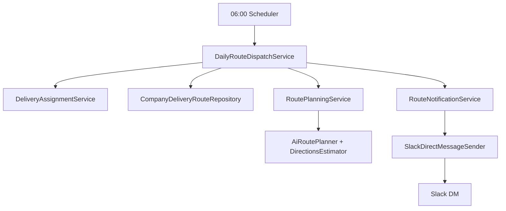

# 주문 Slack 알림 플로우

두 가지 Slack 알림 시나리오(주문 즉시 발송 시한 안내, 매일 아침 배송 루트 안내)가 `module-slack` 안에서 어떻게 동작하는지 정리했습니다. 주문 서비스와의 연계 방식, 레이어별 책임, 확장 포인트(이벤트/Kafka)까지 포함합니다.

---

## 1. 주문 발송 시한 알림 (주문 발생 시)

| 항목 | 내용 |
| --- | --- |
| 트리거 | 주문 서비스에서 발행하는 `OrderDeadlineRequestedEvent` (Spring Application Event) |
| 수신자 | 발송 허브 담당자 (`UserRole.HUB_MANAGER`, `UserRole.DELIVERY_MANAGER`) |
| 핵심 클래스 | `OrderDeadlineEventListener` → `OrderDeadlineFacade` → `OrderDeadlinePlanningService` → `OrderSlackNotificationService` |
| 템플릿 | `ORDER_DEADLINE_ALERT` (부팅 시 `OrderDeadlineTemplateInitializer`가 생성/업데이트) |
| 테스트 | `OrderDeadlineEventListenerTest`, `OrderDeadlineCommandMapperTest`, `OrderDeadlineFacadeTest`, `OrderDeadlinePlanningServiceTest`, `OrderDeadlineTemplateInitializerTest` |

### 플로우
```mermaid
graph TD
    A[Order Service<br>OrderDeadlineRequestedEvent] --> B[OrderDeadlineEventListener]
    B --> C[OrderDeadlineFacade]
    C --> D[OrderDeadlinePlanningService<br>(Gemini)]
    D -->|Plan Result| C
    C --> E[OrderSlackNotificationService]
    E --> F[SlackTemplateRepository]
    E --> G[SlackRecipientFinder]
    E --> H[SlackNotificationSender]
```

1. **도메인 이벤트 발행**: 주문 서비스가 주문 확정 시점에 `OrderDeadlineRequestedEvent`를 발행합니다(동일 애플리케이션 또는 Kafka).
2. **Facade 조율**: `OrderDeadlineFacade`가 AI 계산 결과를 Slack 페이로드(`OrderSlackMessagePayload`)로 변환하고, 기존 `OrderSlackNotificationService`를 재사용해 템플릿 렌더링·수신자 조회·DM 발송까지 마무리합니다 (`OrderDeadlineFacade`:17-75). `OrderDeadlineEventListener`가 이벤트를 수신해 동일 Facade를 호출합니다.
3. **AI/백업 계산**: `OrderDeadlinePlanningService`가 Gemini API를 호출해 `finalDeadline/routeSummary/reason`을 얻고, 실패 시 근무시간/납기 기반 fallback을 제공합니다 (`OrderDeadlinePlanningService`:27-196).
4. **템플릿 시딩**: `OrderDeadlineTemplateInitializer`가 `ORDER_DEADLINE_ALERT`를 자동으로 생성하거나 최신 내용으로 덮어씁니다 (`OrderDeadlineTemplateInitializer`:18-65).
5. **주요 값**: Slack DM에는 주문번호, 고객/상품, 경로 요약, `finalDeadline`, `aiReason`이 포함됩니다 → 발송 허브 담당자가 “언제까지 출발해야 하는지” 실시간으로 인지.

> 🔌 *이벤트 연동*: 동일 애플리케이션 내에서는 `OrderDeadlineRequestedEvent`를 발행하면 Slack 모듈의 `OrderDeadlineEventListener`가 자동으로 처리합니다. 별도 서비스 간 통신이 필요하면 Kafka Consumer를 추가해 동일 Facade를 호출할 수 있습니다.

---

## 2. 일일 배송 루트 알림 (매일 06:00)

| 항목 | 내용 |
| --- | --- |
| 트리거 | `DailyRouteDispatchScheduler`의 `@Scheduled(cron = "0 0 6 * * *")` (Asia/Seoul) |
| 수신자 | 각 업체의 배송 담당자(배송 매니저 Slack ID) |
| 핵심 클래스 | `DailyRouteDispatchScheduler` → `DailyRouteDispatchService` → `RoutePlanningService` → `RouteNotificationService` |
| 템플릿 | `ROUTE_DAILY_SUMMARY` (`RouteSummaryTemplateInitializer`가 보장) |
| 테스트 | `DailyRouteDispatchServiceTest`, `RouteDispatchIntegrationTest`, `RouteSummaryTemplateInitializerTest` |

### 플로우


1. **스케줄링**: `DailyRouteDispatchScheduler`가 매일 오전 6시에 `DailyRouteDispatchService.dispatch(LocalDate)`를 실행합니다 (`DailyRouteDispatchScheduler`:9-24).
2. **경로 조회/배정**: 서비스가 해당 날짜의 경로를 조회하고, 필요한 경우 `DeliveryAssignmentService`로 담당자를 배정합니다 (`DailyRouteDispatchService`:18-67).
3. **AI 경로 계산**: `RoutePlanningService` → `AiRoutePlanner`가 좌표 보정/네이버 Directions 호출로 거리·시간·방문 순서를 얻습니다 (`RoutePlanningService`:17-32, `AiRoutePlanner`:36-196).
4. **Slack 전송**: `RouteNotificationService`가 `ROUTE_DAILY_SUMMARY` 템플릿에 맞춰 Slack DM을 만들어 `SlackDirectMessageSender`를 통해 전송합니다 (`RouteNotificationService`:15-59).
5. **DM 내용**: 담당자 이름, 날짜, 허브, 방문 순서(시간 포함), 예상 거리/시간, AI 요약/사유 등을 담아 배달원이 “오늘 어떤 순서로 돌지” 바로 확인하도록 합니다.

---

## 3. 구현 현황 요약

| 구분 | 구현 여부 | 참고 |
| --- | --- | --- |
| 주문 기반 발송 시한 이벤트 | ✅ | Event Listener/Facade/Service/Template/Test 구성 |
| 주문 서비스 → Slack 연동 방식 | ✅ (Spring Event) / ⏳ (Kafka) | 동일 애플리케이션 이벤트 즉시 사용 가능, Kafka 소비자는 필요 시 추가 |
| 매일 06:00 루트 알림 | ✅ | 기존 Scheduler + Service + Template 운영 중 |
| 템플릿 시딩 | ✅ | `OrderDeadlineTemplateInitializer`, `RouteSummaryTemplateInitializer` |
| 자동 테스트 | ✅ | WebMvc + Service + Facade + Scheduler 대상 단위/통합 테스트 존재 |

---

## 4. 주문 서비스 연동 가이드

1. **Spring Application Event**  
   - 주문 완료 직후 `OrderDeadlineRequestedEvent` 발행.
   - Slack 모듈의 `OrderDeadlineEventListener`가 Facade를 호출해 Gemini 계산 및 DM 전송 수행.

2. **Kafka 이벤트(선택)**  
   - 주문 모듈에서 Kafka 토픽(예: `order-deadline-request`)으로 동일 payload 이벤트 발행.
   - Slack 모듈에 Consumer 추가 → 이벤트를 `OrderDeadlineFacade`에 전달.
   - 장점: 주문 서비스와 Slack 모듈이 느슨하게 결합, 재시도/모니터링 용이.

---

## 5. 향후 확장 아이디어
- **이벤트 기반 Failover**: REST 오류 시 Kafka 이벤트를 큐에 적재해 재처리.
- **허브별 정책 커스터마이징**: `OrderDeadlineCommand`에 허브 정책 필드를 추가해 근무시간·버퍼 시간을 다르게 적용.
- **통합 모니터링**: Slack DM 전송 결과(`Message` 엔티티 상태)와 주문 상태를 대시보드에서 교차 확인.

이 문서를 기준으로 주문 서비스팀과 연동 계약을 맞추고, Kafka 리스너가 필요하면 `OrderDeadlineFacade`를 그대로 호출하도록 Consumer만 추가하면 됩니다.
